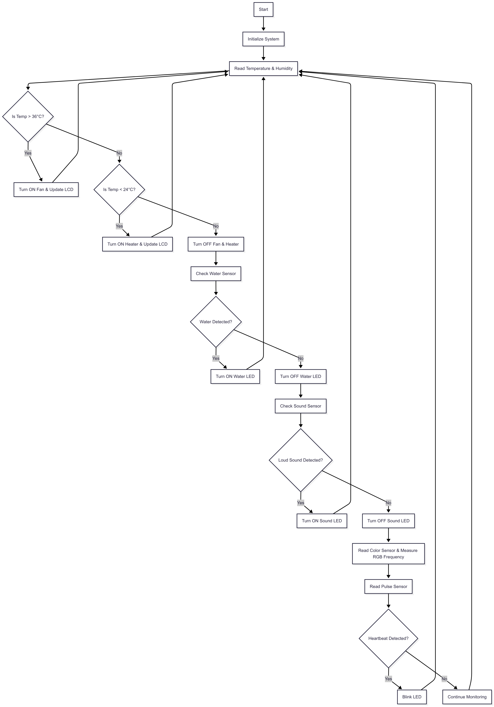

# Baby Incubator Prototype
  

This project is an **Arduino-based Baby Incubator Prototype** designed to monitor and maintain a stable environment for newborns. The system integrates **temperature and humidity control**, **water detection**, **sound detection**, **color monitoring**, and **heart rate monitoring**, ensuring safe and healthy conditions.

---

## 📌 Features
✔ **Temperature & Humidity Control**  
- Maintains optimal temperature range using **fan** and **heater**.  
- Displays temperature and humidity on an **LCD screen**.  

✔ **Water Leakage Detection**  
- Alerts using an LED if water is detected inside the incubator.  

✔ **Sound Monitoring**  
- Detects loud sounds or crying to notify caregivers.  

✔ **Color Sensor**  
- Detects color changes (can be used to monitor light conditions).  

✔ **Heart Rate Monitoring**  
- Tracks baby's heart rate using a pulse sensor and indicates beats through an LED.  

---

## 🛠 Hardware Components
- Arduino Uno (or compatible)
- DHT11 Sensor (Temperature & Humidity)
- Rain/Water Sensor
- Sound Sensor
- TCS3200 Color Sensor
- Pulse Sensor
- 16x2 LCD with I2C module
- Fan & Heater (control temperature)
- LEDs for alerts
- Wires, resistors, breadboard

---

## ⚙ System Workflow
1. Reads **temperature & humidity** using DHT11.
2. Activates **heater** if temperature < 24°C and **fan** if > 36°C.
3. Displays real-time temperature and humidity on LCD.
4. Monitors **water leakage**; turns LED ON if detected.
5. Detects **sound signals** (crying or loud noises).
6. Reads **color frequency** for monitoring lighting conditions.
7. Tracks **heart rate** and blinks LED for each detected beat.

---

## 📊 Flowchart

---

## 🔌 Pin Configuration
| Component        | Arduino Pin  |
|-----------------|--------------|
| DHT11 Sensor    | 2           |
| Fan             | 11          |
| Heater          | 9           |
| Water Sensor    | 12          |
| Water LED       | 13          |
| Sound Sensor    | 3           |
| Sound LED       | 10          |
| Color Sensor S0 | 4           |
| Color Sensor S1 | 5           |
| Color Sensor S2 | 6           |
| Color Sensor S3 | 7           |
| Color Sensor OUT| 8           |
| Pulse Sensor    | A0          |

---

## 💻 Software Requirements
- [Arduino IDE](https://www.arduino.cc/en/software)
- Libraries:
  - `Wire.h`
  - `LiquidCrystal_I2C.h`
  - `DHT.h`

---
